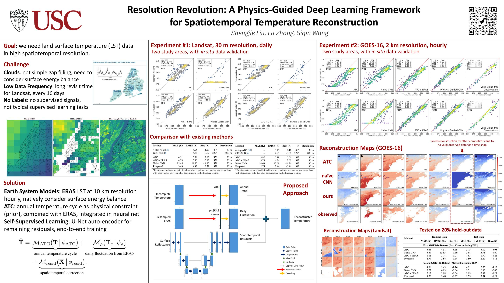

# Resolution Revolution: A Physics-Guided Deep Learning Framework for Spatiotemporal Temperature Reconstruction


[Liu, Shengjie, Lu Zhang, and Siqin Wang. "Resolution revolution: A physics-guided deep learning framework for spatiotemporal temperature reconstruction." ICCV 2025 Workshop on Sustainability with Earth Observation & AI.](https://arxiv.org/abs/2507.09872) 

[](im/poster.png)

## Demo on the PSU Landsat Dataset

To run the demo using the PSU Landsat dataset, follow these steps:

1. **Unzip the Dataset**  
   Extract the `psu.zip` file to the current working directory:
   ```bash
   unzip psu.zip
   ```

2. **Run the Demo Scripts**  
   Execute the following Python scripts in sequence:
   ```bash
   python demo1_psu_01_train.py
   python demo1_psu_02_test.py
   ```

## More to come

Stay tuned for updates!


```bibtex
@article{liu2025resolution,
  title={Resolution Revolution: A Physics-Guided Deep Learning Framework for Spatiotemporal Temperature Reconstruction},
  author={Liu, Shengjie and Zhang, Lu and Wang, Siqin},
  journal={arXiv preprint arXiv:2507.09872},
  year={2025}
}
```
